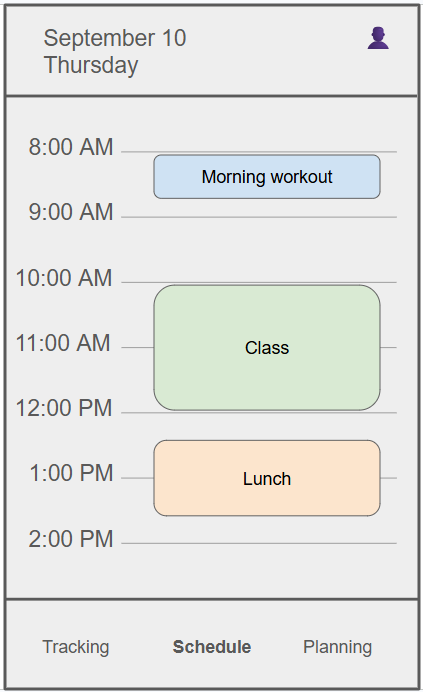
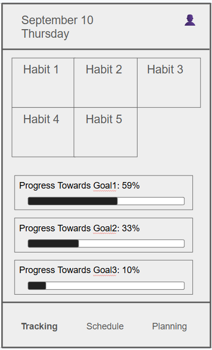
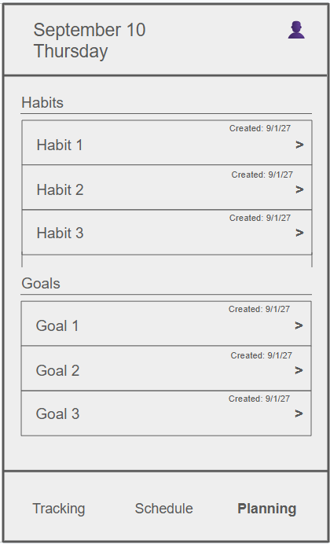
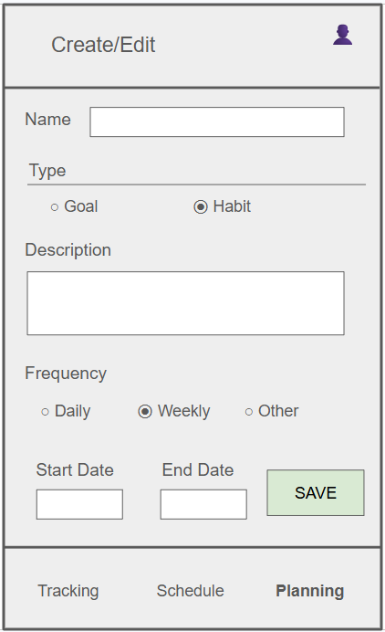
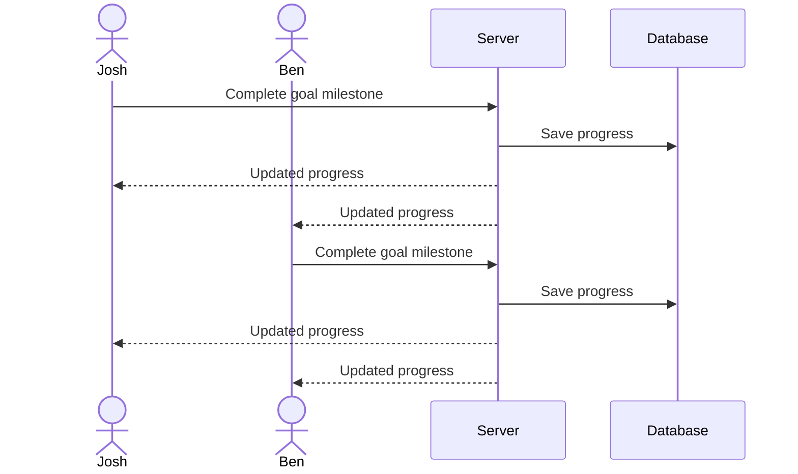

# LiveMyGospel

[My Notes](notes.md)

LiveMyGospel is a personal planning application designed to help people organize their goals, tasks, schedules, and commitments in one place. It is inspired by the PreachMyGospel app that missionaries use in the field, but adapted and simplified for everyday use by regular people. It helps users turn larger goals into manageable plans, organize their daily schedule, and keep track of the everyday responsibilities and habits that they want to stay on top of.

### Elevator pitch

It is easy to have goals for how you want to live your life, but much harder to fit those goals into an already busy schedule, especially with the variability and unpredictability of life. LiveMyGospel helps everyday people, in particular returned missionaries, turn their ambitions into realistic plans by helping them connect short- and long-term goals with the tasks, milestones, schedules, and commitments needed to achieve them. LiveMyGospel gives you a place to organize your life around what you actually want to achieve.

### Design

The main screen of LiveMyGospel will be a daily schedule

The tracking screen will allow users to have a quick overview of their goals and habits

The planning screen allows users to view and manage their current goals and habits 

The create/edit screen is used for creating or editing a specific goal or habit

Here is a diagram of how users can share and keep tabs on each other's goals for accountability

### Key features

 - Create and manage personal goals 
 - Create and track recurring habits
 - Track progress towards goal completion and consistency of habits 
 - Share goals or habits with another user for accountability
 - See shared goal and habit progress updated in realtime
 - Create and manage events in a daily schedule
 - View the current weather alongside the daily schedule
 - Secure user accounts with login, registration, and logout (using HTTPS)

### Technologies

I am going to use the required technologies in the following ways.

- **HTML** - Provide the basic structure and organization for the three main screens of the application, including the daily schedule, goal and habit tracking displays, and list of current goals and habits.
- **CSS** - Style the application and make it responsive across different screen sizes. Make the application clear and intuitive to use with intentional and clean looking design.
- **React** - Provide the frontend components and user interaction for managing goals, habits, and events on the schedule. Handle the create/edit forms for goals and habits. React will also be used for routing between the different pages of the application and updating the interface as users interact with it.
- **Service** - Provide the backend functionality for the application through endpoints for registering, logging in, and logging out users, as well as creating, retrieving, editing, and deleting goals, habits, and scheduled events. The service will also retrieve weather information from [Open-Meteo](https://open-meteo.com/en/docs) weather API.
- **DB/Login** - Store goals, habits, scheduled events, and progress in the database. User authentication information will also be stored securely in the database.
- **WebSocket** - Provide realtime updates for shared goals and habits. When one user updates their progress, the change will be sent to other users sharing that goal or habit without requiring them to refresh the page.

## 🚀 Specification Deliverable

For this deliverable I did the following.

- [x] I completed the prerequisites for this deliverable (Git commit requirement)
- [x] Proper use of Markdown
- [x] A concise and compelling elevator pitch
- [x] Description of key features
- [x] Description of how you will use each technology including your 3rd party API and use of WebSocket
- [x] One or more rough sketches of your application. Images must be embedded in this file using Markdown image references.

> [!NOTE]
> This is a template for your startup application. You must modify this `README.md` file for each phase of your development. You only need to fill in the section for each deliverable when that deliverable is submitted in Canvas. Without completing the section for a deliverable, the TA will not know what to look for when grading your submission. Feel free to add additional information to each deliverable description, but make sure you at least have the list of rubric items and a description of what you did for each item.

> [!NOTE]
> If you are not familiar with Markdown then you should review the [documentation](https://docs.github.com/en/get-started/writing-on-github/getting-started-with-writing-and-formatting-on-github/basic-writing-and-formatting-syntax) before continuing.

## 🚀 AWS deliverable

For this deliverable I did the following. I checked the box `[x]` and added a description for things I completed.

- [x] **Rented EC2 server** - Rented a t3.nano and have the instance up and running
- [x] **Leased domain name** - Leased the name livemygospel.click from NameCheap
- [x] **Server accessible** from my domain: [Link Here](https://livemygospel.click)

## 🚀 HTML deliverable

- [x] **Prerequisites** - I completed the prerequisites for this deliverable (Simon deployed, GitHub link, Git commits)
- [x] **HTML pages** - Created pages for index (which has the dashboard and landing page), login, schedule, and planning
- [x] **Proper HTML element usage** - Used head, body, nav, main, header, footer, and other elements such as forms and sections
- [x] **Links** - Each page has a consistent navigation bar that allows the user to navigate between any page
- [x] **Text** - Each page has text representing the different content and elements on the page
- [x] **3rd party API placeholder** - Created a placeholder on my index.html page for where I will implement a 3rd-party weather API
- [x] **Images** - Added a logo next to the main title on the homepage
- [x] **Login placeholder** - Created a login page with placeholder for username display underneath. Home page also has a placeholder for displaying username (if user is logged in).
- [x] **DB data placeholder** - Specific goals, habits, and events will all be loaded from a database because they will be tied to an individual user. Added HTML comments on index, planning, and schedule pages for areas that the database will be used
- [x] **WebSocket placeholder** - Added a placeholder on index for where friends goals/habits will be shared live

## 🚀 CSS deliverable

For this deliverable I did the following. I checked the box `[x]` and added a description for things I completed.

- [ ] I completed the prerequisites for this deliverable (Simon deployed, GitHub link, Git commits)
- [ ] **Visually appealing colors and layout. No overflowing elements.** - I did not complete this part of the deliverable.
- [ ] **Use of a CSS framework** - I did not complete this part of the deliverable.
- [ ] **All visual elements styled using CSS** - I did not complete this part of the deliverable.
- [ ] **Responsive to window resizing using flexbox and/or grid display** - I did not complete this part of the deliverable.
- [ ] **Use of a imported font** - I did not complete this part of the deliverable.
- [ ] **Use of different types of selectors including element, class, ID, and pseudo selectors** - I did not complete this part of the deliverable.

## 🚀 React part 1: Routing deliverable

For this deliverable I did the following. I checked the box `[x]` and added a description for things I completed.

- [ ] I completed the prerequisites for this deliverable (Simon deployed, GitHub link, Git commits)
- [ ] **Bundled using Vite** - I did not complete this part of the deliverable.
- [ ] **Components** - I did not complete this part of the deliverable.
- [ ] **Router** - I did not complete this part of the deliverable.

## 🚀 React part 2: Reactivity deliverable

For this deliverable I did the following. I checked the box `[x]` and added a description for things I completed.

- [ ] I completed the prerequisites for this deliverable (Simon deployed, GitHub link, Git commits)
- [ ] **All functionality implemented or mocked out** - I did not complete this part of the deliverable.
- [ ] **Hooks** - I did not complete this part of the deliverable.

## 🚀 Service deliverable

For this deliverable I did the following. I checked the box `[x]` and added a description for things I completed.

- [ ] I completed the prerequisites for this deliverable (Simon deployed, GitHub link, Git commits)
- [ ] **Node.js/Express HTTP service** - I did not complete this part of the deliverable.
- [ ] **Static middleware for frontend** - I did not complete this part of the deliverable.
- [ ] **Calls to third party endpoints** - I did not complete this part of the deliverable.
- [ ] **Backend service endpoints** - I did not complete this part of the deliverable.
- [ ] **Frontend calls service endpoints** - I did not complete this part of the deliverable.
- [ ] **Supports registration, login, logout, and restricted endpoint** - I did not complete this part of the deliverable.
- [ ] **Uses BCrypt to hash passwords** - I did not complete this part of the deliverable.

## 🚀 DB deliverable

For this deliverable I did the following. I checked the box `[x]` and added a description for things I completed.

- [ ] I completed the prerequisites for this deliverable (Simon deployed, GitHub link, Git commits)
- [ ] **Stores data in MongoDB** - I did not complete this part of the deliverable.
- [ ] **Stores credentials in MongoDB** - I did not complete this part of the deliverable.

## 🚀 WebSocket deliverable

For this deliverable I did the following. I checked the box `[x]` and added a description for things I completed.

- [ ] I completed the prerequisites for this deliverable (Simon deployed, GitHub link, Git commits)
- [ ] **Backend listens for WebSocket connection** - I did not complete this part of the deliverable.
- [ ] **Frontend makes WebSocket connection** - I did not complete this part of the deliverable.
- [ ] **Data sent over WebSocket connection** - I did not complete this part of the deliverable.
- [ ] **WebSocket data displayed** - I did not complete this part of the deliverable.
- [ ] **Application is fully functional** - I did not complete this part of the deliverable.
